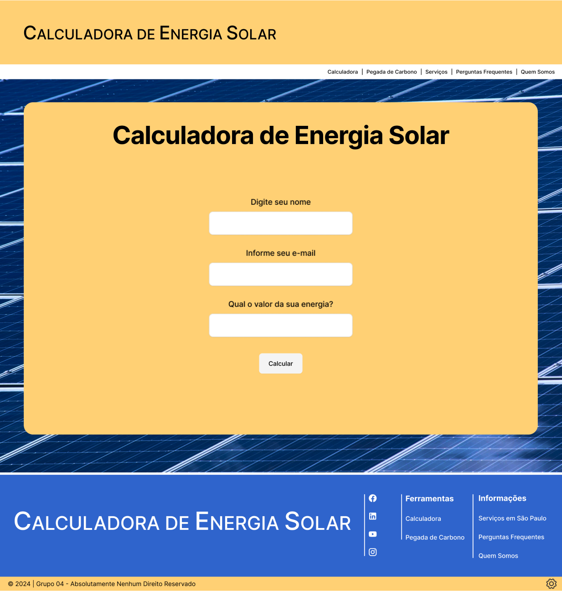
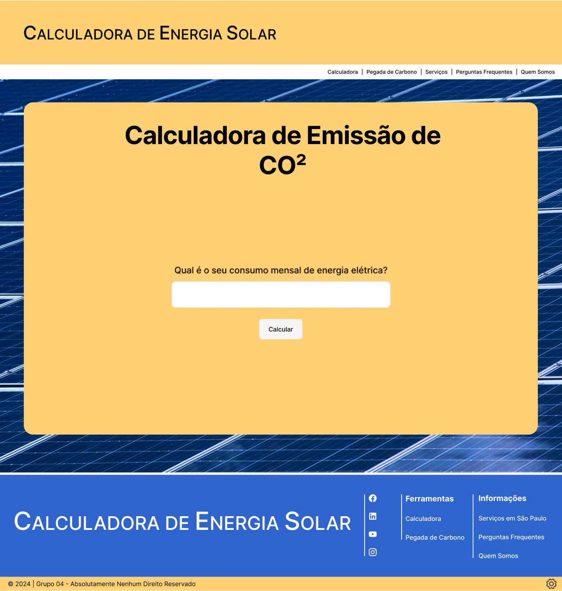
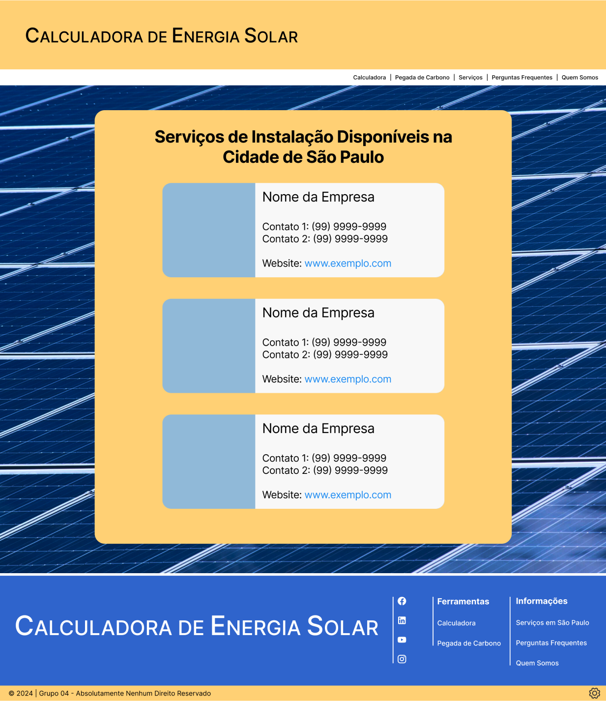
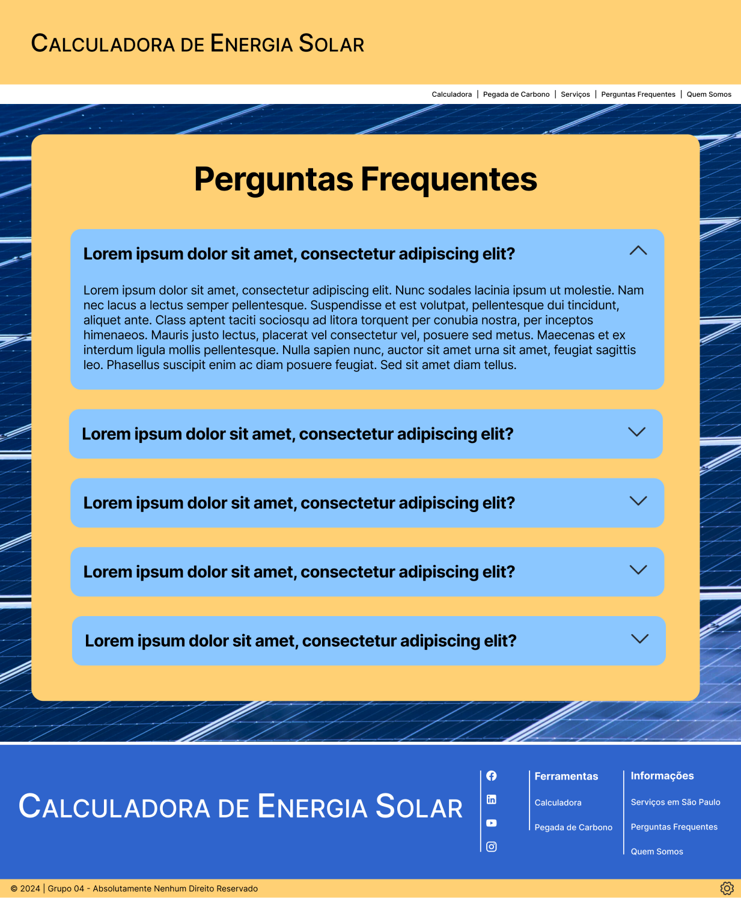
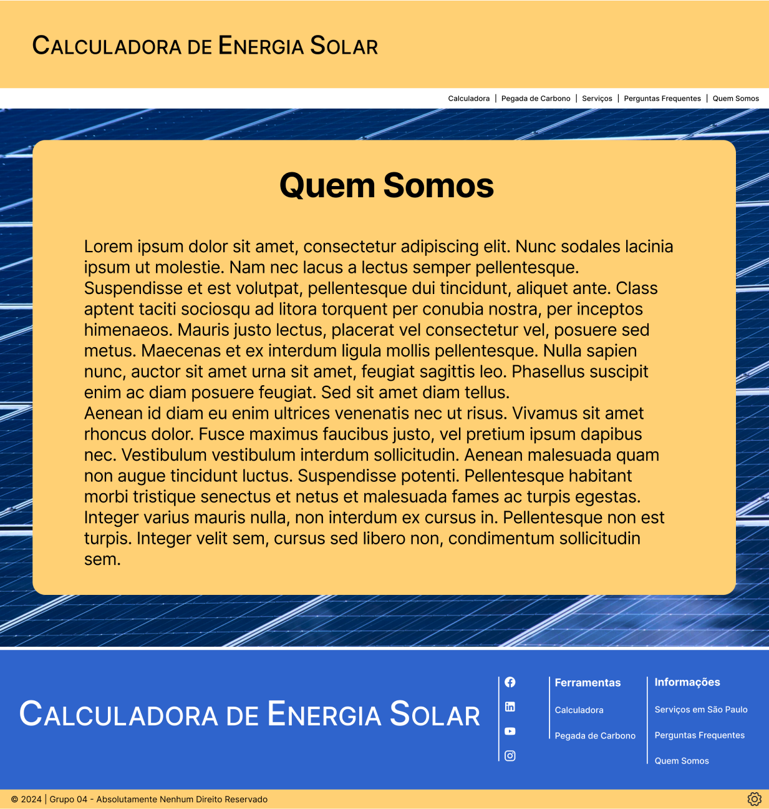
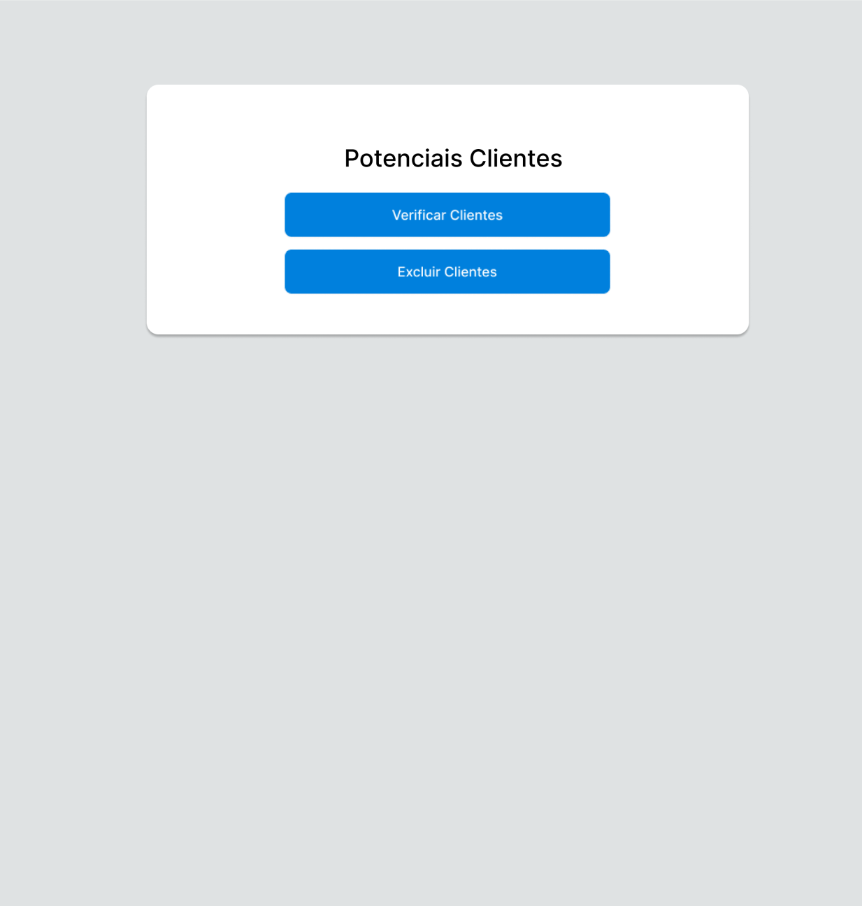

# Projeto de Interface

A interface da aplicação visa oferecer simplicidade em sua navegação e clareza na disposição de suas informações.

## User Flow

## Wireframes

### Página: Calculadora de Energia Solar

### Página: Calculadora de CO²

### Página: Serviços Disponíveis

### Página: Perguntas Frequentes

### Página: Institucional (Quem Somos)

### Página: Admin

